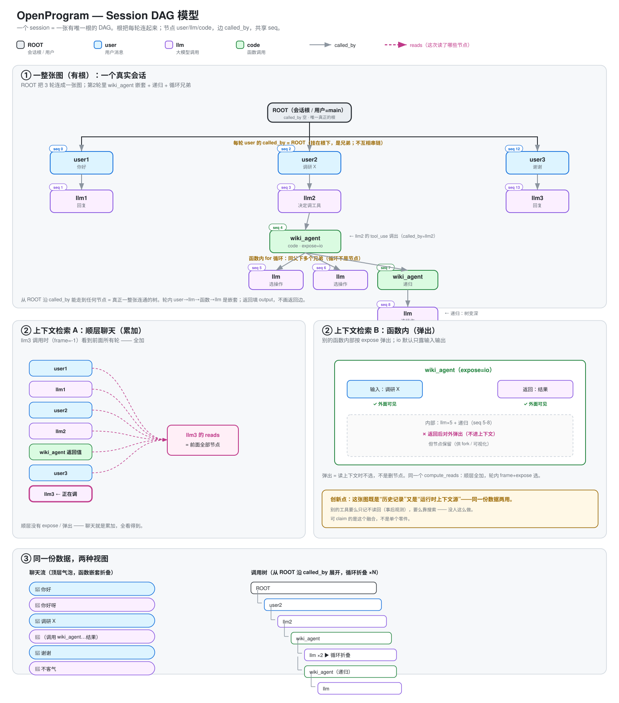

<div id="session-dag-设计"></div>

# 设计概览

> 本文是 agent 执行记录的权威设计：数据模型、边与不变量、分支与 spawn、上下文渲染、
> 上下文装配、压缩。[模型选型与取舍](#模型选型)在本页集中说明。
> 调用流程图见 [`../agent-call-flow.svg`](../agent-call-flow.zh.svg)。
> 可视化渲染规范（布局、连线、图例、默认可见性）是
> [`rendering.zh.md`](rendering.zh.md)——绘制以它为准，本文只讲语义。



## 1. 概述与动机

每个 Agent 执行分别管理自己的 DAG。聊天只记录用户消息、模型请求和直接工具调用；普通辅助函数不产生持久化节点。调用另一个 Agent 时创建独立 DAG，父图只保存调用结果和 child_session_id 引用。权限、取消与文件修改备份仍由原执行负责，不依赖图所有权。

上下文继承与持久化是不同职责；普通计算不因继承 Context 而进入历史。图内保留 caller、predecessor、reads 与 seq。子图的 caller 和上下文历史位置不引用父图节点，跨图关系通过元数据表达。

<div id="llm-agent-追踪圈已经收敛到-span"></div>
<div id="otel-是真共识"></div>
<div id="span-如何满足这些要求"></div>
<div id="span-的缺点"></div>
<div id="与当前模型的距离"></div>
<div id="与设计文档的关系"></div>
<div id="历史先分裂后统一"></div>
<div id="备选方案-基本都用-span"></div>
<div id="执行记录数据模型-选择-span"></div>
<div id="结论"></div>
<div id="路线"></div>
<div id="这是什么领域"></div>
<div id="问题"></div>
<div id="领域格局"></div>
<div id="模型选型"></div>

## 模型选型与取舍

### 为什么使用会话 DAG

执行记录需要同时表达嵌套调用、对话分支，以及每次 LLM 调用实际读取的节点。
所有 LLM 调用使用同一种节点角色，循环迭代是兄弟节点。单一调用树无法同时区分
对话的不同续接分支，时间戳也不能确定回复属于哪个分支。因此分别保留 `caller`、
`predecessor` 和 `reads`，由 `seq` 提供确定的记录顺序。

### 比较过的模型

| 模型 | 适用能力 | 对本设计的限制 |
|---|---|---|
| 扁平日志 | 追加事件，采集简单 | 调用嵌套、分支祖先和上下文读取仍需要显式关系。 |
| Span 树 | 操作标识、父子调用、时间、状态和属性 | 调用父子关系不能替代独立的对话前驱。 |
| 带时间的嵌套区间 | 适合 Chrome Trace / Perfetto 等性能视图 | 时间用于观察执行，不能作为持久化分支关系的定义。 |
| 会话 DAG | 同一记录包含调用、对话分支和上下文读取 | 需要边校验、索引和显式渲染规则；这是内部采用的模型。 |

参考范围包括商业 APM（Datadog、New Relic、Honeycomb、Lightstep）、内核追踪
（Pixie、Cilium）和 agent 可观测性系统（Langfuse、Arize Phoenix/OpenInference、
LangSmith、OpenLLMetry、W&B Weave、Braintrust）。它们用于参考采集、检查与导出方式，
不要求复制其存储模型或产品行为。Span 结构以
[OpenTelemetry 官方追踪模型](https://opentelemetry.io/docs/concepts/signals/traces/)为外部参考。

### 采用与不采用的设计

| 选择 | 结论与原因 |
|---|---|
| 统一操作记录 | 采用：user、llm、code 共享 `Call`，通过角色和 metadata 表达差异。 |
| 父子调用关系 | 采用 `caller`，保留嵌套函数与 LLM 调用的执行归属。 |
| 用时间顺序替代对话边 | 不采用：`predecessor` 是顶层 schema 字段，分叉、重试和分支遍历都需要它。`seq` 只能排序，不能确定分支祖先。 |
| 只把上下文读取记录为追踪事件 | 内部不采用：`reads` 是解释上下文选择的显式节点 ID 列表，遥测导出另行映射。 |
| 把 `caused_by` 作为前置要求 | 当前 schema 不包含它，不能把追踪 link 的设想写成已经实现的字段。 |
| 持久化依赖 OTel SDK | 不采用：会话存储和上下文重建由 OpenProgram 自己管理。 |
| GenAI 属性约定 | 用于参考模型与用量元数据的互通方式；参考规范不代表已实现 exporter。见[官方约定](https://github.com/open-telemetry/semantic-conventions-genai)。 |

### 代价与实现边界

正式操作保留完整记录；普通辅助函数不属于正式记录范围，不是对正式节点采样。
可选调试信息与会话记录分开。调用关系与对话链分别校验。
Token、成本和评估元数据需要显式定义，不能从耗时推断。

字段分别为：`Call.id` 表示身份，`caller` 表示调用关系，`predecessor` 表示对话关系，
`seq` 提供确定顺序，`reads` 记录上下文引用，`metadata` 保存适配器数据。
`created_at` 是墙钟时间，不是排序依据。后续章节给出这些契约，文末实现状态附录
集中记录剩余工作。


## 2. 数据模型

### 节点（Call）

一个数据结构覆盖一切。LLM 调用永远是同一种 `llm` 节点，不因触发方是用户还是函数而
分裂。

```
Call:
  id           唯一标识
  seq          单调递增整数，全局时间序（唯一排序键）
  created_at   墙钟时间（给人看，不用于排序）

  role         "user" | "llm" | "code"   ← 只决定渲染，不分裂本质
  name         模型 id / 函数名 / 用户名

  input        prompt / 函数参数 / None
  output       回复 / 返回值 / 用户文本
  status       running | completed | error | cancelled

  caller       谁调用了我（子调用父 id）；非子调用节点为空
  predecessor  聊天里谁在我前面（对话链父 id）；
               顶层 schema 字段——这条边唯一的存储位置
  reads        本次 LLM 调用读了哪些节点（渲染用引用，不是结构边）
  metadata     token 用量 / 模型 / source / expose / tool_call_id …
               LLM 叶子字段对齐 gen_ai.*
```

定义在 `openprogram/context/nodes.py`。

### 三种 role 与 ROOT

| 场景 | role | caller | predecessor |
|---|---|---|---|
| 会话根（ROOT） | user（特殊，`display=root`） | 空 | 空 |
| 用户发消息 | user | ROOT | 上一轮 llm 回复；会话首节点用哨兵 `"ROOT"` |
| LLM 回复 | llm | 本轮 user（顶层）或所在 code 节点 | 本轮 user |
| LLM 调工具 | code | 该 llm 节点 | — |
| 用户手动调函数 | code | 空 | 当前分支 head（根层为 `"ROOT"`） |
| Agent 内调 LLM / 直接工具 | llm / code | 图内所属操作节点 | — |

循环本身不占节点。循环内真正的模型或工具操作分别记录；普通递归不增加节点。
另一个 Agent 的内部操作保存在独立图内。

### status 词表

所有节点统一一套：`running | completed | error | cancelled`。聊天与函数路径共用；
error 节点带结构化 type/trace 元数据，用户取消写 `cancelled`，绝不写 `error`。

## 3. 边与不变量

### 两条边，绝不混为一条

| 边 | 字段 | 含义 | 谁有 |
|---|---|---|---|
| **子调用边** | `caller` | 谁调用我执行 | 只有真被子调用的节点；普通顶层回复留空 |
| **对话链边** | `predecessor` | 聊天顺序上我接在谁后面 | user / llm 节点 |

两条边都有向无环。`caller` 让所有顶层节点汇聚到 ROOT（一张连通图）；`predecessor`
表达聊天顺序并区分分支。二者正交：

```
一张图（共享 seq，唯一根）。每个节点：caller(C) / predecessor(P)
ROOT
├ user1  seq0  C=ROOT  P="ROOT"   ┐ 顶层 user 经 caller 挂在 ROOT 上；
│  └ llm1 seq1 C=user1 P=user1    │ 对话顺序经 predecessor 成链：
├ user2  seq2  C=ROOT  P=llm1     │   user2.P=llm1, user3.P=llm2
│  └ llm2 seq3 C=user2 P=user2    │ fork = 同一 predecessor 有多个对话子节点
├ user3  seq4  C=ROOT  P=llm2     ┘
```

为什么要两条边：分支必须靠 `predecessor` 区分。用户重发消息时同一位置长出两个子节
点，仅凭 `seq` 分不清哪个子节点属于哪条分支线。单边模型（caller + seq）表达不了分支。

### `predecessor` 是 schema 字段

`predecessor` 是 `Call` 的顶层字段——唯一存储位置。序列化只写顶层；没有 metadata 镜
像，没有旧格式读取路径。把这条边放进 schema 而不是事后校验 metadata，才让读方可以依
赖它：链接错的分支无法被 linter 修复，所以 append 路径必须拒绝制造它。

### 写入不变量

在 store 的 append 路径强制执行（`openprogram/store/session/session_store.py`）：
**每个 ROOT 级对话节点（role 为 user/llm、无真实 caller）必须带 `predecessor`。**
违规 append 抛 `PredecessorMissingError`，而不是悄悄在 ROOT 处 fork 会话。合法例外：

- **会话首节点**与**显式根 fork**——带哨兵 `predecessor="ROOT"`（不是空），所以重试
  首条消息会产生不变量允许的合法 ROOT 级兄弟；
- **spawn 分支根**——只能经 `spawn_branch()`（§4）创建，`predecessor=None`、
  `caller` 指向发起节点；
- **`ask_user` 应答节点**——带非 None `input` 的 user 节点是调用内的被调方回复，
  不是对话轮；
- **压缩 summary 节点**——按 §8 是合法链上成员。

### 读取不变量

`get_branch` 与 `list_branches` 纯沿边行走——没有 caller 回退，没有 seq 拼接，没有
猜测。无 `predecessor` 的节点必须是合法分支终点（spawn 根、ROOT 本身、会话首节
点）；否则就是坏数据，抛 `BrokenPredecessorChainError` 并带上出问题的节点 id。坏数
据浮出水面，绝不被绕过去。

## 4. 分支与 Spawn

<div id="fork"></div>

### 分叉

分支是同一位置上的另一种可能。**分支节点的 `predecessor` 与被替换节点完全相同**——
同一 predecessor 有多个对话子节点即为 fork。不存在特殊节点类型：

| 场景 | 被替换节点 | 分支节点 | 共享边 |
|---|---|---|---|
| 用户重发消息 | user2 (P=llm1) | user2' (P=llm1) | predecessor |
| LLM 重试 | llm1 (P=user1) | llm1' (P=user1) | predecessor |
| 工具重试 | code (C=llm1) | code' (C=llm1) | caller |

### 失败与重试

**error 是终态，不是缺失态。** 抛异常的一轮和成功的一轮走完全相同的收尾：节点以
`status=error` 写入，本轮提交进 git，head 停在这个 error 节点上。失败的这一轮是会话
里发生过的事实，记录里就得这么写。

在错误路径上跳过收尾，会恰好在出问题的地方给 git 时间线留一个洞——而那正是历史最值
得留存的位置。它还会让重试从一个从未写过 commit 的 predecessor 上分叉。用户取消同样
按终态收尾，写 `status=cancelled`。

错误路径上仍然执行的收尾步骤，是那些维持记录完整性的步骤：git 提交、项目提交、
shadow-git 提交、快照淘汰。那些以"已有完整回复"为前提的步骤——context-commit 回填、
用量反馈、自动起标题——对没有回复的一轮没有意义，跳过。

重试不需要单独机制。它就是一次普通 fork：重试节点取失败节点的 predecessor，这一点使
它成为兄弟而非后继。由普通规则直接推出两个结果：

- **失败的那条线保留。** error 节点留在图里且仍可达。切到它那条分支就能看到当时到底
  发生了什么。
- **失败的那条线不进入重试的上下文。** `render_context` 沿活跃分支行走，error 节点不
  在这条分支上。重试永远看不到它正在重试的那个错误。这里没有任何按 status 的过滤，分
  支隔离本身已经做到了。

<div id="spawn"></div>

### 创建子分支

`SessionStore.spawn_branch(session_id, caller_node_id, *, source, name=…)` 是开
干净 spawn 根的**唯一**原语。它创建分支根 user 节点（`predecessor=None`、
`caller=caller_node_id`、`metadata.source`、`metadata.spawn_branch_root=True`），
注册为 head，返回节点 id。spawn 调用方（task runner、协作消息、后台 agent）一律调
用该原语创建干净起点。继承式 spawn 是普通的精确 fork：它的第一个 user 节点以
指定节点为 `predecessor`。

spawn 分支根**不**挂在 ROOT 上：它的 `caller` 指向发起它的节点，经该节点维持单连通
图不变量。对于跨会话精确 fork，源 session S 把 attach 卡片保留在发起节点 A 旁边，
目标 session T 存储新 user 节点：`predecessor=M`、`caller=A`、
`metadata.spawned_from_session=S`。单个 session 的图无法画出指向另一个 session 节点的边，
所以目标图投影把该外部 caller 归到 ROOT，并把节点标记为 `spawn_remote`；源节点标记为
`spawn_out`。源卡片指向 `attach.session_id=T` 和目标分支 head。跨会话 spawn 不移动任一
session 当前选中的 HEAD；目标结果只注册为分支 tip，后续异步回送再作为普通 turn
推进源 session 的 HEAD。

spawn 分支的上下文是干净的：spawn 分支上的 `get_branch` 止步于 spawn 根，不会经
caller 边漏进父分支。spawn 分支的聊天视图只显示本分支自己的历史。反向同样成立：从
父分支 head 做 `render_path` 时，不会沿 `caller` 下探进 spawn 分支（见 §6）。

### 完成通知锚定在 HEAD

异步子 agent 跑完，会往派它的会话里写回两样东西：attach 指针，锚在发起调用的那一轮，
因为调用就发生在那里；以及一条通知轮（`metadata.source = "task_followup"`），锚在会话
**当时的 HEAD**，并像任何一轮那样推进 head。

两者锚点不同，是因为说的不是一件事。attach 指针是一次调用的记录，就该待在调用旁边；
通知是对话里新的一轮，就该待在对话末尾。

这正是 N 个子 agent 不会被回答 N 次的原因。把每条通知都锚在发起它的节点上，它们就成了
同一轮的兄弟——三个子 agent 跑完就是三条平行分支、各自一个回复，用户发了一条消息，眼看
着它被回答三遍。锚在 HEAD 上，它们连成一条链：

```text
… → 发起轮 → 通知₁ → 回答₁ → 通知₂ → 回答₂
```

runner 让 `TurnRequest.branch_from` 保持 `INHERIT_PARENT`，派发前也不再回退 head，锚定
交给 dispatcher 的普通追加路径完成。并发用每个投递会话一把锁处理
（`JobRunner._followup_lock`）：两个子 agent 同一毫秒跑完，也依次占用轮次，第二条读到的
HEAD 已经包含第一条的回答。

## 5. 头指针与分支管理

- **head**：会话维护一个 `head_id`——当前活跃分支的末端。每条写路径都把它推进到真
  实节点 id；函数调用完成后 head 移到实际 code 节点，绝不指向 placeholder。悬空的
  head 会让分支行走不可达、会话渲染为空。
- **get_branch(session_id, head_id)**：从 head 沿 predecessor 链走到终点，返回该分
  支的线性历史。
- **list_branches(session_id)**：枚举 conversation predecessor 图中的叶子节点。
  conversation 节点包括 user、llm，以及 caller 为空或 `ROOT` 的顶层 Program。节点只要
  有任一此类 successor，就是祖先节点，不能再次作为 branch tip。内部 execution child、
  runtime/attach 行与 context 行不延续 conversation，因此不取消其 owner 的 tip 身份。
  共享同一 predecessor 的并行顶层 Program 仍是不同叶子。不存在特殊的主路径 tip
  fallback：已合并节点和非 conversation 节点始终保持排除。分支名存在会话 meta 的
  `branches: {head_id: name}`。

## 6. 上下文渲染

所有上下文都经由 `render_context` 从图中取出。哪些节点进入上下文，由一条判定规则
决定：

> **一个节点进入渲染，当且仅当它沿 `caller` 上溯的最近 ROOT 级祖先位于 `head_id`
> 的 predecessor 主链上，且 frame/expose 规则放行。**

具体过程：`render_context` 从 `head_id` 沿 predecessor 链走到分支起点，得到当前分
支的主链；对主链上的每个节点，再按 frame 与 expose 规则过滤它的 caller 子树，通过
的节点进入渲染。`seq` 只用来排序，不参与上述判定。因此分支之间的隔离由行走过程天然
保证，不需要引擎在取出之后再做过滤。引擎只做三件事：解析 head、调用
`render_context`、把结果交给 `render_dag_messages` 翻译成 provider 消息。

ROOT 本身不算 ROOT 级祖先。所有顶层对话节点都带 `caller="ROOT"`（§3——正是它让全图
连通），若展开 ROOT 的 caller 子树，会把会话里所有兄弟分支重新放进来。ROOT 级节点
的"最近 ROOT 级祖先"就是它自己；行走绝不展开 ROOT。

spawn 分支根（`metadata.spawn_branch_root`）同样不经 `caller` 边进入。spawn 分支是
独立对话，结果经返回值 / attach 指针回流。若从父主链展开 spawn 根，会把 spawn 的
指令和裁决泄漏进发起分支（例如 Goal 工作 Agent 读到自己的 judge）。排除是单向的：
从 spawn 分支内部的 head 渲染时，仍通过主链看到该分支本身。

frame 语义：

- **顶层聊天**（frame = −1）：主链上每一轮全量可见——累加；该分支的所有历史轮平铺
  喂入。
- **函数内**（frame = 该 code 节点的 seq）：frame 前的历史 + 函数自身 frame 内的进
  展可见；其他函数的内部按各自 `expose` 弹出（默认 `io` 只暴露输入输出）。

原语是**纯函数**：读路径不写盘。必须落盘的事（大节点 spill）发生在写路径（§8）。

工具节点的渲染：带 `metadata.tool_call_id` 的 code 节点（模型 tool_use）渲染为真
ToolCall/ToolResult 对、归入所属 llm 节点的 assistant 消息；不带的（直接函数调用）
渲染为文本对。两个视图投影同一份数据：聊天流（顶层 user + llm 按 seq，嵌套折叠）与
调用树（沿 `caller` 全展开，循环兄弟折叠 ×N）。

## 7. 上下文装配

### 一个 system prompt，一个装配器

全项目只有一份 system prompt（身份 + 项目记忆 + 统一工具列表 + skills），由**唯一装
配器** `context.build_system_prompt(agent_profile, tools, mode)` 产出，所有模型调用
共享——顶层聊天与函数体内一视同仁。预算统计的就是实际发出的那个字符串；装配器输出等
于线上输出。

prompt 默认从会话开始到结束恒定。恒定前缀让 provider KV 缓存命中最大化，函数内的模
型也拿到与聊天模型相同的项目背景。推论：

- **不拆分**成聊天版和函数版。
- **没有"可变尾段"**：工具列表也统一，不随调用点变化——一变前缀就变，长上下文全部
  miss。
- **例外走定制层**：个别调用想要精简 system，在调用点显式声明，自愿承担 cache miss。
- 函数内防误调工具（如自递归）靠用户轮开头的情境提示 + 递归深度上限兜底——绝不靠改
  system 工具列表。详见
  [`../execution/agentic-self-recursion.zh.md`](../execution/agentic-self-recursion.zh.md)。

### prompt 被记录，而非隐含

装配出的 prompt 哈希一旦变化（会话开始、工具集变更、plan 模式切换），store 就在当
前分支追加一个 `role=code` 节点，`name="context/system_prompt"`、`caller=ROOT`、
output 为全文。渲染时取主链上最新的该类节点作为线上 system 消息。任何历史调用的
replay 都能复现当时实际发出的 prompt。不引入第四种 role；`context/*` 名字保留并在聊
天视图隐藏（与隐藏 summary 节点同一机制）。

### memory prefetch 位于用户轮内

预取的记忆渲染为**当次用户节点**线上消息内的前缀块，并存入该节点的 metadata
（`memory_prefetch`）。system prompt 与工具段跨轮字节级稳定（历史继续命中缓存），
replay 看到的就是模型当时看到的。该块不参与老化；与本轮其他用户内容一样随轮消亡。

### 多模态内容

图片与文件就是节点内容，与文本无异——没有注入 hook。节点存引用（正文放附件目录），
内容完整又不撑爆搜索索引。`render_context` 取节点即取其全部内容；渲染按引用加载图
片。

## 8. 压缩与老化

### summary 节点入链

压缩是 append-only 的插入。summary 节点为 `role=llm`、`name="context/summary"`、
`predecessor` = 它覆盖的第一个节点的 predecessor、`metadata.covers_ids` =
它所替代的链节点的确切 id 列表（用 id 而非 seq 区间——姐妹分支的 seq 交错）。
其余一切不变：保留尾段保持自己的 id 和 predecessor，不改任何边，HEAD 原地不动
（append 规则只在链延长时推进）。渲染应用链段替换（context/compaction.md
第三节）：完整包含覆盖链段的链渲染为 `[summary, 保留尾段…]`；其他链按原文渲染。
压缩是滚动摘要——每份新摘要吸收上一份，`extra_meta._last_summary_id` 标记唯一
现役者，被取代的摘要是惰性遗迹。

WebUI 载荷把 `covers_ids` 加上被覆盖轮次的 caller 子树后下发到 summary 行
（`webui/graph_builder.py`），渲染器画胶囊和它的折叠时因此不必做 seq 运算——见
dag/rendering.md 第九节。完整规范：context/compaction.md。

### 老化边界只进不退，渲染可精确重放

尾轮老化边界只在轮提交时推进，绝不在轮中途（逐调用滚动的边界每次调用都打破缓存前
缀）。每个 llm 节点在调用发生的那一刻记录
`metadata.render_manifest = {policy_version, aged_before_seq, spilled: [...]}`。
replay 一次调用 = 用 manifest 记录的策略渲染，而不是今天的策略——同一张图任何一天渲
染出相同字节。

### 写时 spill，单一管线

超过阈值的节点在**记录时**落盘 spill（一次、确定性），绝不在碰巧被渲染时——读路径保
持无副作用，正是 §6 的要求。DAG 渲染是**唯一**的上下文管线：没有回退装配路径。渲染
抛错则本轮带错误可见地失败。静默回退会掩盖坏掉的管线；响亮失败才是特性。

## 9. 存储层

会话持久化在 git 后端的 store（`openprogram/store/session/`）：

- 每会话一个磁盘上的 `GitSession`，位于 `<state>/sessions/<id>/`；
- 每会话一个内存中的 `SessionMemoryIndex`，懒加载，持有行走所用的 node-by-id /
  children-by-predecessor 索引；
- `head_id` 与分支名存在会话的 `meta.json`；
- store 只持久化原始节点 + meta；context commit 属于 commit 子系统。

`Agent` method 的函数体在 **spawn** 的子进程里跑（全新解释器而非 fork——父进
程已加载 PyTorch/libomp，fork 后子进程首次 BLAS 调用会 SIGSEGV），stop 可对进程组
SIGKILL。子进程用自己的 SessionStore 写 code 子树；父进程执行结束后 invalidate 缓
存以读取磁盘真相。函数调用的单一事实来源是 SessionStore 的 code 子树；实时
WebSocket 帧与刷新加载都是它的投影，必须产出同一张卡片。

## 附录：实现状态

Agent 图所有权和普通辅助函数不记录的改动已有代码与回归测试；完整实施状态见
[执行记录设计](persistence-observability.zh.html)。下列既有数据模型说明不代表本次修改已完成发布。数据模型、边、不变量、spawn 原语、纯沿边分支行走
（§2–§5）、§6 的路径原生渲染、§7（唯一装配器、`context/system_prompt` 节点、
memory prefetch 迁移）与 §8（基于 `covers` 的 summary 节点、只进不退的老化边界、
render manifest、写路径 spill、单管线强制）在代码中均已成立；细节以
`openprogram/context/nodes.py`、`openprogram/context/components.py`、
`openprogram/context/system_prompt_node.py`、`openprogram/context/aging.py`、
`openprogram/context/spill.py` 与
`openprogram/store/session/session_store.py` 的代码为准。

因此压缩不再需要写入不变量的豁免：summary 节点带着它所覆盖区间的 predecessor，
像任何其他节点一样入链。`context/summary` 是唯一对聊天视图保持可见的
`context/*` 名字——它的输出是替代被覆盖区间的真实对话内容，而非管线机械。

为消融准备了五个环境开关，全部在调用时读取，因此一次实验可以只动一个变量而无需
重新导入：`OPENPROGRAM_TOOL_AGING`、`OPENPROGRAM_TOOL_AGING_TAIL_TURNS`、
`OPENPROGRAM_TOOL_AGING_MAX_RESULT_CHARS`、`OPENPROGRAM_NODE_SPILL`，以及
`OPENPROGRAM_EXPOSE_DEFAULT`（它只改变未指定的 `expose=` 的含义——显式指定始终优先）。

## 相关文件

- `openprogram/context/nodes.py` — Call schema + render_context、`covers` 略去
- `openprogram/context/components.py` — 唯一的 system prompt 装配器（§7）
- `openprogram/context/system_prompt_node.py` — `context/system_prompt`
  记录 + `context/*` 隐藏（§7）
- `openprogram/context/aging.py` — 棘轮式老化边界 + render manifest（§8）
- `openprogram/context/spill.py` — 写路径大节点 spill（§8）
- `openprogram/context/persistence.py` — 基于 `covers` 的 summary 节点（§8）
- `openprogram/context/render.py` — render_dag_messages
- `openprogram/store/session/session_store.py` — append 不变量、get_branch、
  spawn_branch、list_branches
- `openprogram/agent/dispatcher/__init__.py` — 聊天入口、agent loop
- `openprogram/agentic_programming/runtime.py` — 函数体内模型调用
- [`rendering.zh.md`](rendering.zh.md) — 可视化渲染规范（绘制的权威）
